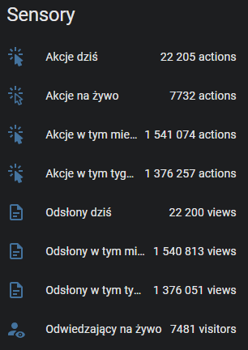
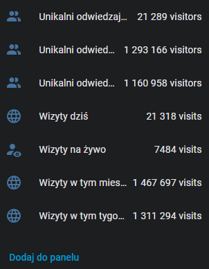
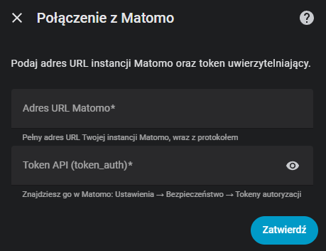

# Matomo Analytics for Home Assistant

Custom Home Assistant integration for [Matomo Analytics](https://matomo.org/) — the leading open-source web analytics platform.

## Features

- **Config Flow UI** — add through Settings → Integrations, no YAML needed
- **Per-site sensors** — unique visitors, page views, visits, actions for today/week/month
- **Live visitors** — currently active visitors on the site (last 30 minutes)
- **Aggregate stats** — combined totals across all Matomo sites (optional)
- **Multi-site support** — add the integration multiple times, one per site
- **Polish & English translations**

## Sensors

### Per-site (15 sensors)

| Sensor | Periods |
|---|---|
| Unique visitors | today, week, month |
| Page views | today, week, month |
| Visits (sessions) | today, week, month |
| Actions (hits) | today, week, month |
| Live visitors / visits / actions | last 30 min |

### Aggregate — all sites (9 sensors, optional)

| Sensor | Periods |
|---|---|
| All sites — visits | today, week, month |
| All sites — page views | today, week, month |
| All sites — actions | today, week, month |

## Installation

### HACS (recommended)

1. Open HACS in Home Assistant
2. Click **⋮** → **Custom repositories**
3. Add `https://github.com/abnvle/ha-matomo` with category **Integration**
4. Search for **Matomo Analytics** and install
5. Restart Home Assistant

### Manual

1. Download the [latest release](https://github.com/abnvle/ha-matomo/releases)
2. Copy `custom_components/matomo` to your `custom_components/` directory
3. Restart Home Assistant

## Configuration

1. Go to **Settings → Devices & Services → Add Integration**
2. Search for **Matomo Analytics**
3. Enter your Matomo URL and API token
4. Select the site to monitor

### Getting the API token

In Matomo: **Administration → Security → Auth Tokens → Create New Token**

The token needs at least **view** access to the site(s) you want to monitor.

## Options

| Option | Default | Description |
|---|---|---|
| Include aggregate stats | Off | Show combined stats for all sites visible to the token |

## Requirements

- Matomo instance with API access enabled
- Matomo 4.x or newer (token sent via POST for security)
- API token with at least **view** access

## Screenshots

| Sensors | Sensors | Setup |
|---|---|---|
|  |  |  |

## Author

**Łukasz Kozik** — [lkozik@evilit.pl](mailto:lkozik@evilit.pl)

## License

[MIT](https://github.com/abnvle/ha-matomo/blob/main/LICENSE)